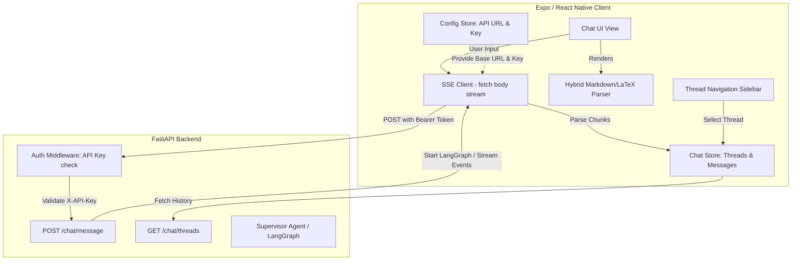

# 2026-07-04 Hermex-like Mobile Client Design

This design specification details the architecture, directory structure, data flows, and rendering strategies for building a custom, React Native (Expo) mobile application client. This client acts as the direct interface between the user and their hosted Vela personal assistant agent backend.

---

## 1. Objectives & Tech Stack

### High-level Objectives:
1. **Dynamic Server Configuration:** The app must not hardcode the backend URL or API credentials. On the first launch, it must prompt the user for the hosted FastAPI server URL and the API Bearer Token.
2. **Streaming Responses:** Support Server-Sent Events (SSE) over HTTP POST to display agent outputs in real-time with a smooth typewriter-like effect.
3. **Multiple Conversation Threads:** Enable users to create, delete, and switch between isolated chat threads.
4. **Rich Rendering:** Support standard Markdown (lists, headers, inline/block code formatting) alongside LaTeX mathematical equations (inline `$...$` and block `$$...$$`) rendered beautifully.
5. **Modern Aesthetics:** A premium, dark-themed UI featuring glassmorphism, smooth animations, and clear typography.

### Technology Stack:
*   **Framework:** Expo SDK 51+ (TypeScript, Managed Workflow).
*   **Routing & Navigation:** Expo Router (File-based routing, Drawer navigation).
*   **State Management:** Zustand (lightweight, decoupled state with persistence middleware).
*   **Local Persistence:** `@react-native-async-storage/async-storage` for configuration and local metadata.
*   **Styling:** `NativeWind` (TailwindCSS v4 styling for React Native) or standard React Native StyleSheet with custom style tokens.
*   **Markdown Renderer:** `react-native-markdown-display`.
*   **LaTeX Engine:** KaTeX rendered inside `react-native-webview` (for pixel-perfect formula layout).
*   **HTTP/SSE:** Built-in `fetch` with stream reading capabilities or `react-native-sse`.

---

## 2. System Architecture

The mobile client functions as a thin, highly interactive interface. All AI reasoning, vector database search, self-improvement, and tool execution (Gmail, Calendar, E2B) occur on the FastAPI backend.



---

## 3. Directory Layout

The following file layout should be generated during project initialization:

```text
client/
├── App.tsx                   # Core app wrapper / entry point
├── app.json                  # Expo config file
├── package.json              # Dependencies mapping
├── tailwind.config.js        # NativeWind/Tailwind styling config
├── app/                      # Expo Router screens folder
│   ├── _layout.tsx           # Configures Drawer navigation & providers
│   ├── index.tsx             # Active Chat Screen (Main UI)
│   ├── setup.tsx             # Welcome / First-launch Setup Screen (URL & Key input)
│   └── settings.tsx          # Settings Screen (Change URL/Key, theme options)
├── components/
│   ├── chat/
│   │   ├── ChatBubble.tsx    # Individual message bubble container
│   │   ├── ChatInput.tsx     # Text input bar, send button, active stream indicators
│   │   ├── LatexRenderer.tsx # WebView wrapper specifically for KaTeX rendering
│   │   └── RichText.tsx      # Hybrid Markdown + LaTeX splitter and renderer
│   ├── ui/
│   │   ├── DrawerContent.tsx # Custom sidebar drawer component listing threads
│   │   └── GlassView.tsx     # Custom wrapper for glassmorphism styling
├── store/
│   ├── useChatStore.ts       # Manages threads, messages list, loading/streaming states
│   └── useConfigStore.ts     # Manages API base URL and access token
└── utils/
    ├── sse.ts                # Helper to parse SSE byte streams into text chunks
    └── latexExtractor.ts     # Regex utility to split strings into Markdown vs Math blocks
```

---

## 4. API Specification for Backend-Client Alignment

The backend must expose the following REST endpoints. All requests require the header:
`Authorization: Bearer <CONFIGURED_API_KEY>`

### 1. **Health Verification**
*   **Endpoint:** `GET /health` or `GET /`
*   **Response:** `{"status": "ok"}`
*   **Purpose:** Verified during first-time setup to ensure the entered URL and API key are valid.

### 2. **Fetch Thread List**
*   **Endpoint:** `GET /chat/threads`
*   **Response:**
    ```json
    [
      { "id": "uuid-1", "title": "Setup E2B sandbox", "updated_at": "2026-07-04T12:00:00Z" },
      { "id": "uuid-2", "title": "Drafting project plan", "updated_at": "2026-07-04T10:15:00Z" }
    ]
    ```

### 3. **Fetch Thread Messages**
*   **Endpoint:** `GET /chat/threads/{thread_id}`
*   **Response:**
    ```json
    [
      { "id": "msg-1", "role": "user", "content": "Explain Schrödinger's Equation", "created_at": "2026-07-04T12:00:00Z" },
      { "id": "msg-2", "role": "assistant", "content": "The Schrödinger equation is: $$i\\hbar\\frac{\\partial}{\\partial t}\\Psi = \\hat{H}\\Psi$$", "created_at": "2026-07-04T12:00:10Z" }
    ]
    ```

### 4. **Send Message & Stream Response**
*   **Endpoint:** `POST /chat/message`
*   **Payload:**
    ```json
    {
      "thread_id": "uuid-1",
      "message": "Calculate the derivative of x^2"
    }
    ```
*   **Response Content-Type:** `text/event-stream`
*   **Payload Stream Chunks format:**
    ```text
    data: {"type": "content", "delta": "The "}
    data: {"type": "content", "delta": "derivative "}
    data: {"type": "content", "delta": "is "}
    data: {"type": "content", "delta": "$2x$"}
    data: {"type": "done", "thread_title": "Derivative of x^2"}
    ```

---

## 5. Key Frontend Implementation details

### 5.1. First-Launch Setup Hook (Route Guard)
The app root layout (`app/_layout.tsx`) must check the config state. If credentials do not exist, it forces navigation to `/setup` using Expo Router's redirection logic:

```typescript
// app/_layout.tsx wrapper logic
import { useEffect } from 'react';
import { useRouter, useSegments } from 'expo-router';
import { useConfigStore } from '../store/useConfigStore';

export default function Layout() {
  const { isConfigured } = useConfigStore();
  const segments = useSegments();
  const router = useRouter();

  useEffect(() => {
    const inSetupSegment = segments[0] === 'setup';
    if (!isConfigured && !inSetupSegment) {
      // Redirect unconfigured user to setup
      router.replace('/setup');
    } else if (isConfigured && inSetupSegment) {
      // Prevent configured user from visiting setup again
      router.replace('/');
    }
  }, [isConfigured, segments]);

  // Render navigation components (Drawer / Stack)
}
```

### 5.2. Custom SSE Stream Handler
Since standard React Native Javascript environment does not fully support node-streams, the implementing agent should use `fetch` with `react-native-fetch-api` (supporting text streaming) or a custom handler that parses chunked responses:

```typescript
// utils/sse.ts example structure
export async function streamAgentResponse(
  url: string,
  apiKey: string,
  threadId: string,
  message: string,
  onChunk: (chunk: string) => void,
  onDone: (newTitle?: string) => void,
  onError: (error: Error) => void
) {
  try {
    const response = await fetch(`${url}/chat/message`, {
      method: 'POST',
      headers: {
        'Content-Type': 'application/json',
        'Authorization': `Bearer ${apiKey}`,
        'Accept': 'text/event-stream',
      },
      body: JSON.stringify({ thread_id: threadId, message }),
    });

    if (!response.ok) {
      throw new Error(`Server returned HTTP ${response.status}`);
    }

    // Standard reader check. If browser-fetch polyfill is set up:
    const reader = response.body?.getReader();
    const decoder = new TextDecoder();

    if (!reader) {
      throw new Error("Response body is not readable");
    }

    let buffer = '';
    while (true) {
      const { value, done } = await reader.read();
      if (done) break;

      buffer += decoder.decode(value, { stream: true });
      const lines = buffer.split('\n');
      
      // Save last unfinished line back to buffer
      buffer = lines.pop() || '';

      for (const line of lines) {
        const cleaned = line.trim();
        if (cleaned.startsWith('data: ')) {
          const rawData = cleaned.slice(6);
          try {
            const parsed = JSON.parse(rawData);
            if (parsed.type === 'content') {
              onChunk(parsed.delta);
            } else if (parsed.type === 'done') {
              onDone(parsed.thread_title);
            }
          } catch {
            // Ignore malformed JSON chunks
          }
        }
      }
    }
  } catch (error: any) {
    onError(error);
  }
}
```

### 5.3. Hybrid Markdown + LaTeX Rendering
To render LaTeX elegantly without rendering the entire chat bubble in a sluggish WebView, we split the message text dynamically.
1. The message content is split into **text segments** using regex to distinguish normal Markdown text from LaTeX equations (`$...$` and `$$...$$`).
2. Normal text blocks are passed to `react-native-markdown-display`.
3. Math blocks are passed to `LatexRenderer` (a highly-optimized, small, and transparent `WebView` component that renders KaTeX).

#### **Regex Extractor Code (`utils/latexExtractor.ts`):**
```typescript
export interface ContentSegment {
  type: 'markdown' | 'latex-inline' | 'latex-block';
  content: string;
}

export function parseContent(text: string): ContentSegment[] {
  // Regex to match block math $$...$$ and inline math $...$
  const regex = /(\$\{[\s\S]*?\}\$|\$\$[\s\S]*?\$\$|\$[\s\S]*?\$)/g;
  const parts = text.split(regex);
  
  return parts.map(part => {
    if (part.startsWith('$$') && part.endsWith('$$')) {
      return { type: 'latex-block', content: part.slice(2, -2).trim() };
    } else if (part.startsWith('$') && part.endsWith('$')) {
      return { type: 'latex-inline', content: part.slice(1, -1).trim() };
    }
    return { type: 'markdown', content: part };
  }).filter(p => p.content.length > 0);
}
```

#### **KaTeX WebView Renderer (`components/chat/LatexRenderer.tsx`):**
```tsx
import React from 'react';
import { StyleSheet, View } from 'react-native';
import { WebView } from 'react-native-webview';

interface LatexRendererProps {
  formula: string;
  isBlock: boolean;
}

export const LatexRenderer: React.FC<LatexRendererProps> = ({ formula, isBlock }) => {
  const html = `
    <!DOCTYPE html>
    <html>
      <head>
        <meta name="viewport" content="width=device-width, initial-scale=1.0, user-scalable=no">
        <link rel="stylesheet" href="https://cdn.jsdelivr.net/npm/katex@0.16.8/dist/katex.min.css">
        <script src="https://cdn.jsdelivr.net/npm/katex@0.16.8/dist/katex.min.js"></script>
        <style>
          body {
            margin: 0;
            padding: 0;
            background-color: transparent;
            color: #cdd6f4; /* Catppuccin mocha text color */
            font-family: -apple-system, system-ui;
            display: flex;
            justify-content: ${isBlock ? 'center' : 'flex-start'};
            align-items: center;
            overflow: hidden;
          }
          #math {
            font-size: 16px;
            white-space: nowrap;
          }
        </style>
      </head>
      <body>
        <div id="math"></div>
        <script>
          try {
            katex.render(${JSON.stringify(formula)}, document.getElementById('math'), {
              displayMode: ${isBlock},
              throwOnError: false
            });
          } catch (e) {
            document.getElementById('math').innerText = e.message;
          }
        </script>
      </body>
    </html>
  `;

  // Dynamic height adjustment for block formulas
  const height = isBlock ? 65 : 24;

  return (
    <View style={[styles.container, { height }]}>
      <WebView
        originWhitelist={['*']}
        source={{ html }}
        scrollEnabled={false}
        style={styles.webview}
        containerStyle={styles.containerStyle}
      />
    </View>
  );
};

const styles = StyleSheet.create({
  container: {
    marginVertical: 4,
    backgroundColor: 'transparent',
  },
  webview: {
    backgroundColor: 'transparent',
  },
  containerStyle: {
    backgroundColor: 'transparent',
  }
});
```

---

## 7. Implementation Phases for the Agent

To execute this, the developer agent should work sequentially through these phases:

### **Phase 1: Project Scaffolding & Config Store**
*   Initialize the Expo application: `npx -y create-expo-app@latest client --template blank-typescript`
*   Install dependencies: `expo install expo-router react-native-safe-area-context react-native-screens react-native-gesture-handler @react-native-async-storage/async-storage zustand react-native-webview`
*   Build the `useConfigStore.ts` state manager.
*   Implement the `/setup` configuration screen with connection testing logic checking backend health.

### **Phase 2: Navigation & Thread State**
*   Configure file-based router and Drawer navigation (`app/_layout.tsx`).
*   Implement the Custom Thread Drawer sidebar listing stored threads.
*   Implement Thread state in `useChatStore.ts` (Active Thread ID, local metadata persistence, CRUD helpers for list).

### **Phase 3: Text & Math Render Pipeline**
*   Add `react-native-markdown-display` and `react-native-webview`.
*   Implement the `utils/latexExtractor.ts` splitter.
*   Combine components into `RichText.tsx` which maps sections of a message to either Markdown or WebView-KaTeX containers.

### **Phase 4: Streaming Chat UI & Auto-Scrolling**
*   Build `ChatInput.tsx` and the message rendering list in `app/index.tsx`.
*   Implement `streamAgentResponse` using SSE.
*   Apply typewriter streaming state updates in Zustand.
*   Use flatlist reference parameters to automatically run `.scrollToEnd()` when new chunks arrive, unless the user manually scrolls up.

### **Phase 5: Styling Polish**
*   Apply dark mode palette styling (e.g., deep slate backgrounds, light pastel text, glassmorphism borders).
*   Add nice layout animations for sending/receiving events.
