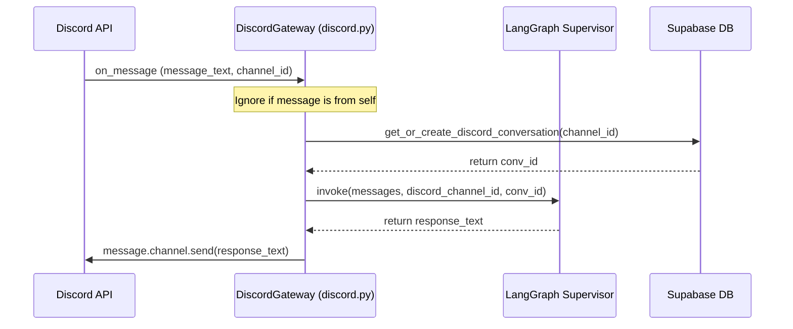

# Discord Gateway Integration Design Spec

Date: 2026-07-01  
Topic: Discord Gateway Integration  

## 1. Objective
Add a Discord Gateway bot connection to Vela. This allows users to interact with the personal assistant via Discord channels and DMs.

## 2. Requirements & Constraints
- **Library**: `discord.py` (v2.x or latest stable) to handle WebSocket gateway protocol.
- **Connection Mode**: Run as a persistent background task within the FastAPI application lifespan.
- **Message Content**: Must require and enable `message_content` intent to read messages.
- **Database**: Store Discord conversations based on `discord_channel_id` using a dedicated column in the `conversations` table.
- **Environment Variables**:
  - `DISCORD_BOT_TOKEN`: Token for the bot client.

## 3. Database Modifications
In `db/schema.sql`, we need to support conversations created from Discord. 
- Remove `NOT NULL` from `telegram_chat_id` in case the conversation originated from Discord.
- Add `discord_channel_id` as a nullable `BIGINT UNIQUE` field.

```sql
-- Migration steps
ALTER TABLE conversations ALTER COLUMN telegram_chat_id DROP NOT NULL;
ALTER TABLE conversations ADD COLUMN IF NOT EXISTS discord_channel_id BIGINT UNIQUE;
```

We also update `db/supabase.py` with:
```python
def get_or_create_discord_conversation(self, discord_channel_id: int) -> str:
    # Query database and insert if not existing, returning the conversation UUID
```

## 4. Architecture & Data Flow



## 5. Gateway Implementation (`gateway/discord.py`)
A class `DiscordGateway` wrapping `discord.Client`. It will expose `start()` and `close()` methods that can be run asynchronously.

```python
import discord
import os
import asyncio
from langchain_core.messages import HumanMessage
from agent.graph import graph
from utils.logger import StructuredLogger
from db.supabase import SupabaseDB

class DiscordGateway:
    def __init__(self, db: SupabaseDB):
        self.logger = StructuredLogger("DiscordGateway")
        self.db = db
        intents = discord.Intents.default()
        intents.message_content = True
        intents.messages = True
        self.client = discord.Client(intents=intents)
        self._register_handlers()

    def _register_handlers(self):
        @self.client.event
        async def on_ready():
            self.logger.info("Discord Bot connected", bot_user=str(self.client.user))

        @self.client.event
        async def on_message(message: discord.Message):
            if message.author == self.client.user:
                return

            self.logger.info("Received Discord message", channel_id=message.channel.id, author=str(message.author))
            
            try:
                # Get or create conversation for this channel
                conv_id = self.db.get_or_create_discord_conversation(message.channel.id)
                
                # Invoke LangGraph
                inputs = {
                    "messages": [HumanMessage(content=message.content)],
                    "telegram_chat_id": 0,  # Or default mock value
                    "db_conv_id": conv_id,
                    "relevant_memories": [],
                    "next_node": ""
                }
                
                # Send typing indicator
                async with message.channel.typing():
                    res = await asyncio.to_thread(graph.invoke, inputs)
                
                assistant_reply = "I couldn't process that request."
                if res.get("messages"):
                    assistant_reply = res["messages"][-1].content
                
                await message.channel.send(assistant_reply)
                self.logger.info("Sent reply to Discord", channel_id=message.channel.id)
            except Exception as e:
                self.logger.error("Error handling Discord message", error=str(e))

    async def start(self):
        token = os.getenv("DISCORD_BOT_TOKEN")
        if not token or token == "your_discord_bot_token":
            self.logger.warning("DISCORD_BOT_TOKEN is not set. Discord gateway will not start.")
            return
        self.logger.info("Starting Discord bot client...")
        await self.client.start(token)

    async def close(self):
        self.logger.info("Closing Discord bot client...")
        await self.client.close()
```

## 6. Integration in FastAPI Lifespan (`agent/main.py`)
Using FastAPI's `@app.on_event("startup")` and `@app.on_event("shutdown")` (or the newer `lifespan` handler):
- Start the discord gateway task in the background: `asyncio.create_task(discord_gateway.start())`
- Cancel and close on shutdown.

## 7. Testing Plan
- Unit tests in `tests/test_discord.py` using `unittest.mock` to mock `discord.Message`, `discord.Client`, and `SupabaseDB`.
- Test that message handling triggers `graph.invoke` with the right conversation ID, and calls `message.channel.send`.
