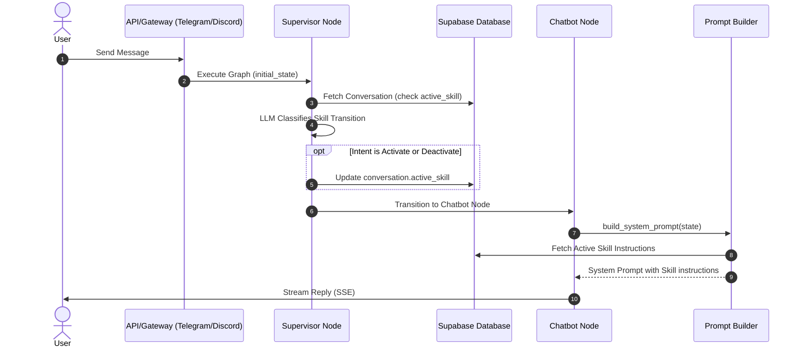

# Vela Dynamic Skills Injection via System Prompt Design

**Date:** 2026-07-07  
**Status:** Approved  
**Author:** Antigravity (AI Coding Assistant)  

---

## 1. Overview & Goal
The objective is to implement multi-turn, cognitive agent skills (e.g. Brainstorming, Grilling) in Vela using a **Dynamic Prompt Injection** approach. 

Vela currently executes statelessly per-message. To support multi-turn skills without complex graph routing, we will:
1. Persist the `active_skill` state in the database for each conversation thread.
2. Use the `supervisor_node` to classify user intent to activate, continue, or deactivate a skill.
3. Convert the prompt builder and chatbot nodes to run asynchronously to execute the active skill's prompt instructions and dynamically inject them into the system prompt.

---

## 2. Architecture & Data Flow



---

## 3. Detailed Component Designs

### A. Database Model & Migration
An `active_skill` column is added to the `conversations` table to track which skill is active for a thread.

1. **SQL Schema Update** ([db/schema.sql](file:///D:/work/projects/Vela/db/schema.sql)):
   ```sql
   ALTER TABLE conversations ADD COLUMN IF NOT EXISTS active_skill VARCHAR(50) DEFAULT NULL;
   ```
2. **SQLAlchemy Declarative Model** ([db/models.py](file:///D:/work/projects/Vela/db/models.py)):
   ```python
   class Conversation(Base):
       # ... existing columns ...
       active_skill = Column(String(50), nullable=True, default=None)
   ```
3. **Database Client CRUD helpers** ([db/client.py](file:///D:/work/projects/Vela/db/client.py)):
   ```python
   def update_conversation_active_skill(self, conversation_id: str, active_skill: str | None) -> Conversation | None:
       conv = self.session.query(Conversation).filter_by(id=conversation_id).first()
       if conv:
           conv.active_skill = active_skill
           conv.updated_at = datetime.now(UTC).replace(tzinfo=None)
           self.session.flush()
       return conv
   ```
4. **Auto-Migration on Lifespan** ([agent/main.py](file:///D:/work/projects/Vela/agent/main.py)):
   ```python
   if 'active_skill' not in columns:
       logger.info("Database migration: adding 'active_skill' column to 'conversations' table")
       with engine.begin() as conn:
           conn.execute("ALTER TABLE conversations ADD COLUMN active_skill VARCHAR(50) DEFAULT NULL")
   ```

---

### B. Agent State & Supervisor Intent Classification
We track the active skill inside the LangGraph state and use the supervisor to manage state transitions.

1. **State Update** ([agent/state.py](file:///D:/work/projects/Vela/agent/state.py)):
   ```python
   class AgentState(TypedDict):
       messages: Annotated[Sequence[BaseMessage], add_messages]
       telegram_chat_id: int
       db_conv_id: str
       relevant_memories: list[str]
       next_node: str
       persona: str
       active_skill: Optional[str]
   ```
2. **Supervisor node updates** ([agent/graph.py](file:///D:/work/projects/Vela/agent/graph.py)):
   * Load the current `active_skill` from the database.
   * Format the supervisor prompt with available skills and descriptions:
     ```python
     from skills import skills
     skills_with_descriptions = "\n".join([f"- {s.name}: {s.description}" for s in skills])
     ```
   * Ask the LLM to output a structured routing schema:
     ```python
     class SkillClassification(BaseModel):
         intent: Literal["activate", "deactivate", "continue", "none"]
         skill_name: Optional[str] # Must match name of a registered skill (e.g. BrainstormingSkill)
     ```
   * Perform database updates based on classification (`activate` -> update to `skill_name`, `deactivate` -> `None`).
   * Pass the resolved `active_skill` to `state["active_skill"]` and set `next_node = "chatbot"`.

---

### C. Chatbot Node & Prompt Builder
The active skill prompt is fetched and injected dynamically.

1. **Async Conversion** ([agent/graph.py](file:///D:/work/projects/Vela/agent/graph.py)):
   Convert `chatbot_node` to an `async def` function to enable asynchronous calls inside the LangGraph execution flow.
2. **Async System Prompt Builder** ([agent/prompt.py](file:///D:/work/projects/Vela/agent/prompt.py)):
   * Convert `build_system_prompt` to `async def`.
   * Check for the active skill, import it, and await its `.execute(state)` response:
     ```python
     active_skill_prompt = ""
     active_skill_name = state.get("active_skill")
     if active_skill_name:
         from skills import skills
         skill_obj = next((s for s in skills if s.name == active_skill_name), None)
         if skill_obj:
             active_skill_prompt = await skill_obj.execute(state)
     ```
   * Inject `active_skill_prompt` into the system prompt's instructions block.

---

## 4. Testing & Verification Plan

### Unit Tests
1. **Database Client Tests** ([tests/test_client.py](file:///D:/work/projects/Vela/tests/test_client.py)):
   * Verify retrieving and updating `active_skill` column.
2. **Prompt Builder Tests** ([tests/test_graph.py](file:///D:/work/projects/Vela/tests/test_graph.py)):
   * Update existing prompt builder tests to be `async def`.
   * Add a test case validating that if `active_skill="BrainstormingSkill"`, the brainstorming instructions are successfully injected into the returned system prompt.
3. **Supervisor Routing Tests** ([tests/test_graph.py](file:///D:/work/projects/Vela/tests/test_graph.py)):
   * Test intent classification for triggering activation, continuation, and deactivation.
